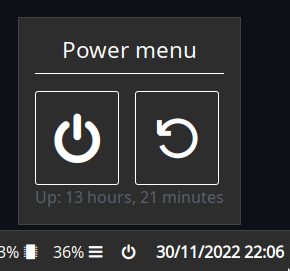

Creates a button on the bar, which opens a popup. The popup contains a header, shutdown button, restart button, and uptime.



## Configuration

<details>
<summary>JSON</summary>

```json
{
  "end": [
    {
      "type": "clock"
    },
    {
      "bar": [
        {
          "on_click": "popup:toggle",
          "label": "",
          "name": "power-btn",
          "type": "button"
        }
      ],
      "class": "power-menu",
      "popup": [
        {
          "orientation": "vertical",
          "type": "box",
          "widgets": [
            {
              "label": "Power menu",
              "name": "header",
              "type": "label"
            },
            {
              "type": "box",
              "widgets": [
                {
                  "class": "power-btn",
                  "on_click": "!shutdown now",
                  "label": "<span font-size='40pt'></span>",
                  "type": "button"
                },
                {
                  "class": "power-btn",
                  "on_click": "!reboot",
                  "label": "<span font-size='40pt'></span>",
                  "type": "button"
                }
              ]
            },
            {
              "label": "Up: {{30000:uptime -p | cut -d ' ' -f2-}}",
              "name": "uptime",
              "type": "label"
            }
          ]
        }
      ],
      "type": "custom"
    }
  ]
}
```

</details>

<details>
<summary>TOML</summary>

```toml
[[end]]
type = 'clock'

[[end]]
class = 'power-menu'
type = 'custom'

[[end.bar]]
on_click = 'popup:toggle'
label = ''
name = 'power-btn'
type = 'button'

[[end.popup]]
orientation = 'vertical'
type = 'box'

[[end.popup.widgets]]
label = 'Power menu'
name = 'header'
type = 'label'

[[end.popup.widgets]]
type = 'box'

[[end.popup.widgets.widgets]]
class = 'power-btn'
on_click = '!shutdown now'
label = '''<span font-size='40pt'></span>'''
type = 'button'

[[end.popup.widgets.widgets]]
class = 'power-btn'
on_click = '!reboot'
label = '''<span font-size='40pt'></span>'''
type = 'button'

[[end.popup.widgets]]
label = '''Up: {{30000:uptime -p | cut -d ' ' -f2-}}'''
name = 'uptime'
type = 'label'
```

</details>

<details>
<summary>YAML</summary>

```yaml
end:
- type: clock
- bar:
  - on_click: popup:toggle
    label: 
    name: power-btn
    type: button
  class: power-menu
  popup:
  - orientation: vertical
    type: box
    widgets:
    - label: Power menu
      name: header
      type: label
    - type: box
      widgets:
      - class: power-btn
        on_click: '!shutdown now'
        label: <span font-size='40pt'></span>
        type: button
      - class: power-btn
        on_click: '!reboot'
        label: <span font-size='40pt'></span>
        type: button
    - label: 'Up: {{30000:uptime -p | cut -d '' '' -f2-}}'
      name: uptime
      type: label
  type: custom
```

</details>

<details>
<summary>Corn</summary>

```corn
let {
    $power_menu = {
        type = "custom"
        class = "power-menu"

        bar = [ { type = "button" name="power-btn" label = "" on_click = "popup:toggle" } ]

        popup = [ {
            type = "box"
            orientation = "vertical"
            widgets = [
                { type = "label" name = "header" label = "Power menu" }
                {
                    type = "box"
                    widgets = [
                        { type = "button" class="power-btn" label = "<span font-size='40pt'></span>" on_click = "!shutdown now" }
                        { type = "button" class="power-btn" label = "<span font-size='40pt'></span>" on_click = "!reboot" }
                    ]
                }
                { type = "label" name = "uptime" label = "Up: {{30000:uptime -p | cut -d ' ' -f2-}}" }
            ]
        } ]
    }
} in {
    end = [ $power_menu ]
}
```
</details>

## Styling

```css
.power-menu {
    margin-left: 10px;
}

.power-menu #power-btn {
    color: white;
    background-color: #2d2d2d;
}

.power-menu #power-btn:hover {
    background-color: #1c1c1c;
}

.popup-power-menu {
    padding: 1em;
}

.popup-power-menu #header {
    color: white;
    font-size: 1.4em;
    border-bottom: 1px solid white;
    padding-bottom: 0.4em;
    margin-bottom: 0.8em;
}

.popup-power-menu .power-btn {
    color: white;
    background-color: #2d2d2d;
    border: 1px solid white;
    padding: 0.6em 1em;
}

.popup-power-menu .power-btn + .power-btn {
    margin-left: 1em;
}

.popup-power-menu .power-btn:hover {
    background-color: #1c1c1c;
}
```